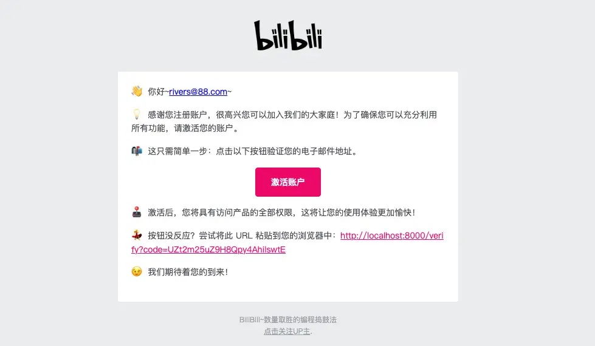
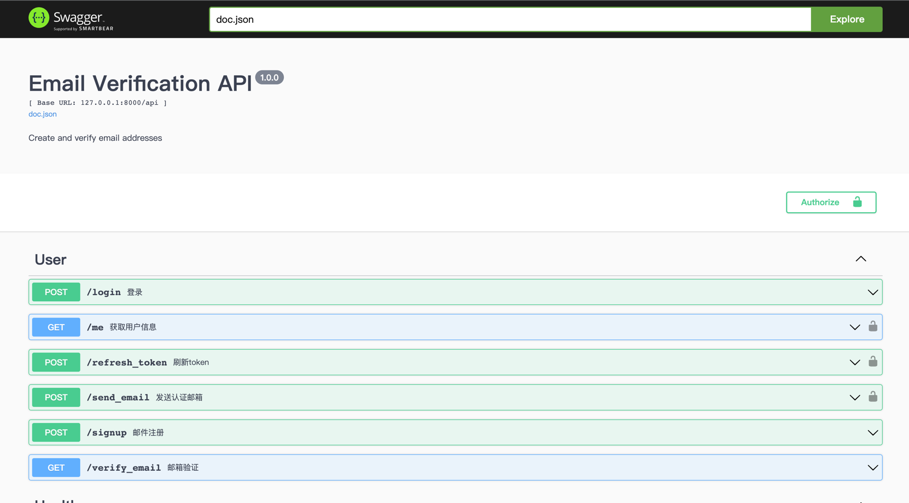

## go-email-verification

<p align='center'>
  
</p>

<p align='center'>
 email verification By <b>Gin</b><sup><em>(speed)</em></sup><br>
</p>
<br>

## Features

- 🐰 数据持久化 MongoDB
- 🦊 验证码缓存 Redis
- 🐼 邮件发送 SMTP
- 🐮 邮件模板 HTML
- 🐦 接口文档 Swagger

## SNAPSHOTS

### Swagger

<p align='center'>
  
</p>

有些前端不喜欢在电脑上装客户端，swagger会成为他的好盆友

``` golang
type PingResponse struct {
	CommonResponse
	Msg string `json:"Message" example:"pong"`
}

// Ping godoc
// @Summary Test if server is alive
// @Schemes
// @Tags Common
// @Produce json
// @Success 200 {object}  models.PingResponse
// @Router /ping [get]
func Ping(c *gin.Context) {
    c.JSON(200, gin.H{
        "message": "pong",
    })
}
```

### jwt

其实jwt服务端做很麻烦，但是客户端调用简单。

可谓一门舍己为人的技术

注意一下几点：

- 除签发时间到期外，没有其他办法让已经生成的JWT失效，除非服务器端换算法。
- JWT不应该存储敏感的信息
- 如果一意孤行的存放敏感信息，请再次加密。
- 最好设置较短的过期时间，防止被盗用后一直有效，降低损失。
- Payload也可以存储一些业务信息，以便减少数据库的压力。

``` golang
func InitAuthMiddlewares(controllers controllers.UserControllers) (*jwt.GinJWTMiddleware, error) {
    return jwt.New(&jwt.GinJWTMiddleware{
        IdentityKey:      "id",
        Realm:            "email-verification",
        SigningAlgorithm: "HS256",
        Key:              []byte(config.GetConfig().JwtKey),
        Timeout:          time.Hour * time.Duration(config.GetConfig().JwtAccessAge),
        MaxRefresh:       time.Hour * time.Duration(config.GetConfig().JwtRefreshAge),
        TokenLookup:      "header: Authorization, query: token, cookie: jwt",
        TokenHeadName:    "Bearer",
        TimeFunc:         time.Now,
        Authenticator:    controllers.Login,
        Authorizator:     authorizedFunc,
        PayloadFunc:      payloadHandle,
        LoginResponse:    loginResponse,
        Unauthorized:     unauthorizedFunc,
        IdentityHandler:  identityHandler,
    })
}

...

authMiddleware, err := middles.InitAuthMiddlewares(controllersImpl)
if err != nil { panic(err) }
router.POST("/login", authMiddleware.LoginHandler)
router.GET("/refresh_token", authMiddleware.RefreshHandler)
router.GET("/logout", authMiddleware.LogoutHandler)
router.GET("/user", authMiddleware.MiddlewareFunc(), controllersImpl.Info)
```

### requestID

- 如何将客户端请求与服务端日志关联
- 微服务架构下，访问日志如何查询
- 不同项目交互出现异常，如何做日志关联

答案：requestID

``` golang
r := gin.New()
r.Use(requestid.New())

r.GET("/ping", func(c *gin.Context) {
   c.String(http.StatusOK, "pong "+fmt.Sprint(time.Now().Unix()))
})

r.Run(":8080")
```

### Email-template

golang自带的html/template模板，可以很方便的实现邮件模板

注意，很多邮件客户端对html的style支持不太好，所以需要使用premailer将html转换为内联样式

``` golang
template.ExecuteTemplate(&body, "email-verify.html", &data)
htmlString := body.String()
prem, _ := premailer.NewPremailerFromString(htmlString, nil)
htmlInline, err := prem.Transform()
m := gomail.NewMessage()

m.SetHeader("From", from)
m.SetHeader("To", to)
m.SetHeader("Subject", data.Subject)
m.SetBody("text/html", htmlInline)
m.AddAlternative("text/plain", html2text.HTML2Text(body.String()))

d := gomail.NewDialer(smtpHost, smtpPort, smtpUser, smtpPass)
d.TLSConfig = &tls.Config{InsecureSkipVerify: true}

```

## 相关阅读

### Swagger

[Golang and MongoDB using the official mongo-driver](https://wb.id.au/computer/golang-and-mongodb-using-the-mongo-go-driver/)

[Gin middleware with Swagger 2.0](https://github.com/swaggo/gin-swagger)

[使用swag自动生成Restful API文档](https://razeen.me/posts/go-swagger)

### JWT

[Issue:jwt in swagger not include `Bearer`](https://github.com/swaggo/gin-swagger/issues/90)

[如何在Gin框架中使用JWT实现认证机制](https://juejin.cn/post/7042520107976753165)

[JWT Middleware for Gin Framework](https://github.com/appleboy/gin-jwt)

[gin-jwt-example](https://github.com/appleboy/gin-jwt/blob/master/_example/basic/server.go)

[Request ID middleware for Gin Framework](https://github.com/gin-contrib/requestid)

### Email

[在线预览和内联email-html-style](https://htmlemail.io/inline/)

[在线编辑email-html](https://app.postdrop.io/)

[响应式邮件模板](https://github.com/leemunroe/responsive-html-email-template)
